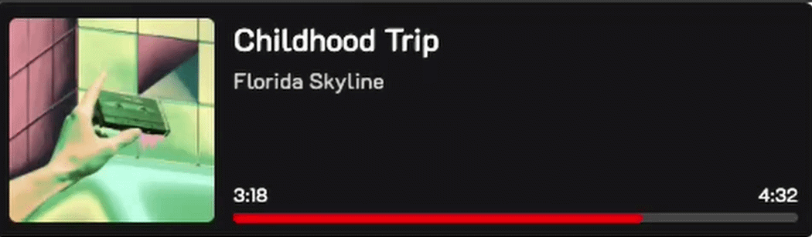

# gogoSpoty

Spotify "Now Playing" OBS widget with Twitch chat song requests.

Shows the current track, artist, album art, and progress bar as a browser source in OBS. Twitch viewers can request songs via `!sr` command in chat — requests are queued in Redis and automatically added to Spotify playback.

## Demo



## Features

- Real-time OBS widget with track info, album cover, and progress bar
- Twitch chat integration (`!sr <song name>` to request tracks)
- Redis-backed song queue
- Per-user cooldowns on song requests
- Graceful shutdown (SIGINT/SIGTERM)

## Requirements

- Docker and Docker Compose **or** Go 1.26+ with Redis
- Spotify Premium account
- Twitch account
- [Spotify Developer App](https://developer.spotify.com/dashboard) (Client ID + Secret)
- [Twitch Developer App](https://dev.twitch.tv/console) (Client ID + Secret)

## Project Structure

```
gogoSpoty/
├── cmd/gogoSpoty/       — entry point
├── internal/
│   ├── app/             — application assembly and lifecycle
│   ├── bot/             — Twitch bot, song queue, cooldowns, auth
│   ├── config/          — configuration (all env vars)
│   ├── crypto/          — random state generation for OAuth
│   ├── poller/          — Spotify playback polling and queue processing
│   └── widget/          — Spotify OAuth, HTTP server, track state, OBS widget handlers
├── static/              — widget HTML/CSS/JS and placeholder image
├── Dockerfile
├── docker-compose.yml
├── Dockerfile
├── docker-compose.yml
├── Makefile
└── go.mod
```

## Installation

Choose one of three methods:

### Option 1: Docker Compose (recommended)

Requires Docker and Docker Compose. No need to install Go or Redis.

```bash
git clone https://github.com/Sirwq/gogoSpoty.git
cd gogoSpoty
cp .env.example .env
# Edit .env with your credentials
docker compose up --build
```

To stop:

```bash
docker compose down
```

### Option 2: Download Release Binary

Requires Redis running locally.

1. Download the binary for your platform from [Releases](https://github.com/Sirwq/gogoSpoty/releases)
2. Download `.env.example` and `static/` folder from the repository
3. Rename `.env.example` to `.env` and fill in your credentials
4. Set `REDIS_ADDR=localhost:6379` in `.env`
5. Start Redis (`redis-server` or `docker run -d -p 6379:6379 redis`)
6. Place the binary, `.env`, and `static/` folder in the same directory:

```
your-folder/
├── gogoSpoty        (or gogoSpoty.exe on Windows)
├── .env
└── static/
    ├── widget.html
    ├── script.js
    ├── styles.css
    └── placeholder.png
```

7. Run the binary:

```bash
./gogoSpoty          # Linux/macOS
gogoSpoty.exe        # Windows
```

### Option 3: Build from Source

Requires Go 1.26+ and Redis.

```bash
git clone https://github.com/Sirwq/gogoSpoty.git
cd gogoSpoty
cp .env.example .env
# Edit .env, set REDIS_ADDR=localhost:6379
make run
```

## Configuration

Edit `.env` with your credentials. See `.env.example` for all available options.

Redirect URLs in `.env` must match those configured in your Spotify Dashboard and Twitch Developer Console.

On first launch, the app will print OAuth URLs for Spotify and Twitch — open them in a browser to authorize. Tokens are saved locally and reused on next start.

## Usage

### OBS Widget

Add a **Browser Source** in OBS with URL:

```
http://localhost:5111/widget
```

Recommended size: 500×150. Set background to transparent.

### Song Requests

Viewers type in Twitch chat:

```
!sr never gonna give you up
```

The bot searches Spotify, adds the first result to the queue, and confirms in chat. Songs are queued to Spotify playback automatically.

## Makefile

| Command | Description |
|---|---|
| `make build` | Build the binary |
| `make run` | Build and run |
| `make clean` | Remove the binary |
| `make release` | Build binaries for Linux, macOS, Windows |
| `make docker` | Start with Docker Compose |
| `make docker-down` | Stop Docker Compose |

## API

| Endpoint | Description |
|---|---|
| `GET /widget` | OBS browser source |
| `GET /api/current` | Current track JSON |
| `GET /static/*` | Static assets |

## License

MIT